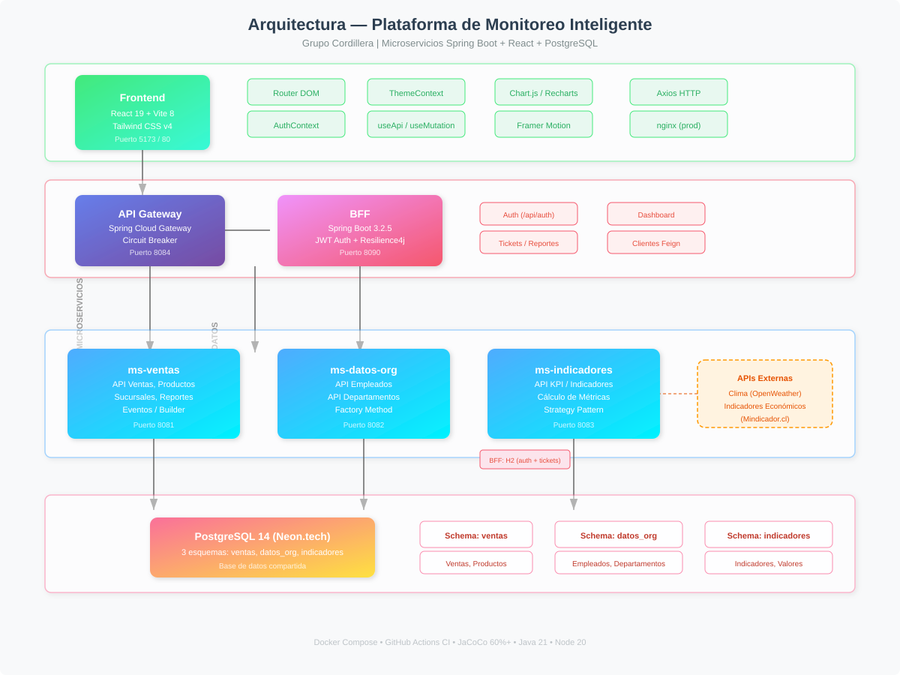

# Plataforma de Monitoreo Inteligente

Sistema fullstack de microservicios para la gestión y monitoreo de ventas, productos, empleados e indicadores KPI. Desarrollado por **Grupo Cordillera** para Duoc UC — Desarrollo Fullstack III.

## Arquitectura



| Componente | Tecnología | Puerto |
|---|---|---|
| **Frontend** | React 19 + Vite 8 + Tailwind CSS v4 | 5173 / 80 |
| **BFF** | Spring Boot 3.2.5 + JWT + Resilience4j | 8090 |
| **API Gateway** | Spring Cloud Gateway 2023.0.3 | 8084 |
| **ms-ventas** | Spring Boot + JPA + PostgreSQL | 8081 |
| **ms-datos-org** | Spring Boot + JPA + PostgreSQL | 8082 |
| **ms-indicadores** | Spring Boot + JPA + PostgreSQL | 8083 |
| **Base de Datos** | PostgreSQL 14 (Neon.tech) | 5432 |

## Módulos

```
ms-ventas/         → API de ventas, productos, sucursales, reportes
ms-datos-org/      → API de empleados y departamentos
ms-indicadores/    → API de indicadores KPI y métricas
bff/               → Backend For Frontend (auth, tickets, dashboard)
api-gateway/       → Gateway con routing y circuit breaker
frontend/          → SPA React (Ventas, Dashboard, Tickets, etc.)
archetypes/        → Arquetipos Maven para nuevos servicios
```

## Inicio Rápido

```bash
# Desarrollo (frontend + backend)
docker compose up -d

# Solo frontend
cd frontend && npm run dev

# Tests frontend
cd frontend && npm test

# Tests backend (todos los módulos)
./mvnw clean test -q
```

## Credenciales por Defecto

| Rol | Usuario | Contraseña |
|---|---|---|
| Admin | admin | admin123 |
| Vendedor | vendedor1 | vendedor123 |
| Bodeguero | bodeguero1 | bodeguero123 |

## Patrones Implementados

- **API Gateway** — Punto único de entrada con routing y circuit breaker
- **BFF** — Backend especializado para el frontend con agregación de datos
- **Repository** — Abstracción de persistencia vía Spring Data JPA
- **Factory Method** — Creación de empleados y estrategias de cálculo
- **Strategy** — Algoritmos intercambiables para indicadores KPI
- **Observer** — Eventos de dominio (venta registrada, stock update)
- **Builder** — Construcción de objetos complejos (Venta)
- **Circuit Breaker** — Resiliencia en llamadas entre servicios
- **Cache-Aside** — Caching con Caffeine en BFF
- **Custom Hook** — Hooks `useApi` y `useMutation` en React
- **Provider** — Contextos Auth y Theme en React
- **ProtectedRoute** — Rutas protegidas por rol

## Links

- [Guía de Instalación](GUIA-INSTALACION.md)
- [Análisis de Patrones](docs/analisis-patrones-arquetipos.md)
- [Informe Técnico](docs/informe-tecnico-final.md)
- [Plan de Branching](docs/plan-branching.md)
- [Plan de Pruebas](docs/plan-pruebas.md)
- [Persistencia](docs/persistencia.md)
- [Informe de Pruebas Unitarias](docs/informe-pruebas.md)
